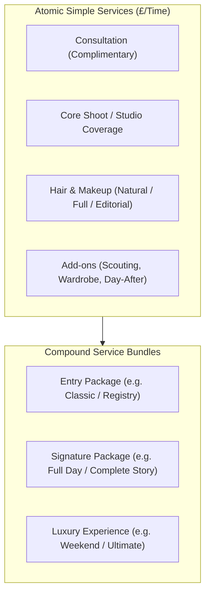

# 📋 Gary Wallage Photography — Multi-Site Master Implementation Registry

Based on the complete specification in `~/GWP Website Docs` and `~/GWP Website Stories`, this registry establishes the single source of truth and implementation work packages across all 7 multisite domains.

---

## 🎨 1. Design Tokens & Genre Identity Matrix

| Sub-Site | Genre | Primary Color | Accent Color | Identity & Style |
| :--- | :--- | :--- | :--- | :--- |
| **`wedding.garywallage.uk`** | Wedding | `#B08D55` (Estate Gold) | `#C5A059` (Light Gold) | Editorial Luxury, Timeless, Architecture & Light |
| **`boudoir.garywallage.uk`** | Boudoir & Dudoir | `#B08585` (Dusty Rose) | `#C5A5A5` (Rose Mist) | Intimate, Empowering, Safe, Soft Natural Light |
| **`glamour.garywallage.uk`** | Studio & Editorial Glamour | `#11110E` (Onyx) | `#B08D55` (Burnished Gold) | Bold, Striking, High-Fashion Studio Magazine Flair |
| **`family.garywallage.uk`** | Family & Generation | `#2C5E3B` (Forest Green) | `#7BB661` (Warm Meadow) | Genuine, Candid, Movement, Outdoor Parkland |
| **`fashion.garywallage.uk`** | Fashion & Commercial | `#1A1A1A` (Graphite) | `#D4AF37` (Metallic Gold) | Structural, Authority, Silk & Textile Construction |
| **`cosplay.garywallage.uk`** | Cosplay & Cinematic | `#5B2C6F` (Imperial Purple) | `#9B59B6` (Neon Amethyst) | Dramatic Lighting, Character Fidelity, Cinema FX |
| **`staging.garywallage.uk`** | Portrait & Headshots | `#1A365D` (Navy Blue) | `#4A90E2` (Sky Blue) | Corporate Profile, Personal Brand, Actor Portfolios |

---

## 📦 2. Work Packages (Ready to Implement)

### 🏷️ Package A: Multi-Genre Child Theme Engine
* [ ] **WP-A1: Create `gary-boudoir-pro` Child Theme**
  * Color tokens: `#B08585` / `#C5A5A5` / Velvet Charcoal `#1C1A1B`.
  * Dedicated Boudoir typography and gentle corner radii.
* [ ] **WP-A2: Create `gary-glamour-pro` Child Theme**
  * Color tokens: `#11110E` / `#B08D55` with high-contrast editorial lookbook styles.
* [ ] **WP-A3: Create `gary-family-pro`, `gary-fashion-pro`, `gary-cosplay-pro`, `gary-portrait-pro` Child Themes**
  * Inherit core Gutenberg blocks (Z-Pattern, Investment Plaque, 3D Hero, Accordion FAQ, Dynamic Savings).
  * Apply genre-specific color palettes and button styling.

---

### 📅 Package B: Bookly Service Catalog Matrix (By Site)

* [ ] **WP-B1: Wedding (`wedding.`)**: 16 Atomic Services + 13 Compound Packages (`W01`–`W12`, `WH1`–`WH4`, `CW01`–`CW10`, `CH01`).
* [ ] **WP-B2: Boudoir (`boudoir.`)**: 6 Atomics + 3 Compounds:
  * `B00` Boudoir Consultation (£0)
  * `B01` Boudoir Studio Session
  * `B02` Dudoir Studio Session
  * `BH1`–`BH3` Hair & Makeup / Editorial Grooming
  * `CB01` The Boudoir Experience
  * `CB02` The Dudoir Experience
  * `CB03` The Glamour Boudoir
* [ ] **WP-B3: Glamour (`glamour.`)**: 6 Atomics + 3 Compounds (`GL00`–`GL02`, `GLH1`–`GLH3`, `CGL01`–`CGL03`).
* [ ] **WP-B4: Family (`family.`)**: 6 Atomics + 3 Compounds (`F00`–`F05`, `CF01` The Family Story, `CF02` The Generation Session, `CF03` The Milestone).
* [ ] **WP-B5: Fashion (`fashion.`)**: 7 Atomics + 3 Compounds (`FS00`–`FS04`, `FSH1`–`FSH2`, `CFS01` The Lookbook, `CFS02` The Editorial Campaign, `CFS03` The Designer Showcase).
* [ ] **WP-B6: Cosplay (`cosplay.`)**: 5 Atomics + 3 Compounds (`C00`–`C03`, `CH1`, `CC01` The Hero Session, `CC02` The Dual Character, `CC03` The Cinematic Story).
* [ ] **WP-B7: Portrait / Headshots (`staging.`)**: 7 Atomics + 4 Compounds (`P00`–`P04`, `PH1`–`PH2`, `CP01`–`CP04`).

---

### 📖 Package C: Real Story & Portfolio Ingestion
* [ ] **WP-C1: Ingest Wedding Stories** (*A Church in April*, *The Military Wedding*, *Blunsdon House*, *Fifty Years*, etc. from `doc_wedding.docx`).
* [ ] **WP-C2: Ingest Boudoir & Dudoir Stories** (Real sessions, empowerment narratives, and privacy framing from `doc_boudoir.docx`).
* [ ] **WP-C3: Ingest Glamour Stories** (*Dressed in Fire and Gold*, *Art Is on the Skin*, *Into the Neon*, *West Wittering* from `doc_glamour.docx`).
* [ ] **WP-C4: Ingest Family, Fashion, Cosplay & Portrait Stories** (From `doc_family.docx`, `doc_fashion.docx`, `doc_cosplay.docx`, `doc_portrait.docx`).
* [ ] **WP-C5: Link Master CR2 / RAW files** via `gallery-master-sync` into WebP media libraries.

---

### 🔒 Package D: Security & Integration Hardening
* [ ] **WP-D1: WP 2FA by Melapress Policy Implementation**:
  * Mandatory TOTP / Passkey enforcement for Administrator & Editor roles.
  * Customer role 2FA optional / bypassed to prevent WooCommerce balance payment URL interception.
* [ ] **WP-D2: Contract & Document Engine**:
  * Integrate `Wedding-Photography-Contract-Template.docx` into DocuSeal and `gw-pdf-brochure`.
