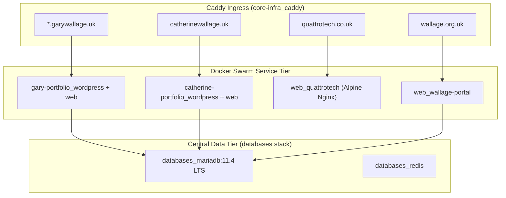

# 🏛️ Host Apache & MariaDB ➔ Docker Swarm Migration Blueprint

## 1. Current State Assessment

The host OS currently runs native systemd services for:
* **Apache2 (`apache2.service`)**: Listening on `127.0.0.1:8090` and proxied by Caddy (`host.docker.internal:8090`).
* **MariaDB 11.2 (`mariadb.service`)**: Listening on `127.0.0.1:3306` hosting 7 databases.

### Database Inventory:
| Database | Associated Application | Migration Strategy |
| :--- | :--- | :--- |
| **`catherinedb`** | Catherine Wallage Website | Import to `databases_mariadb` -> New `catherine-portfolio` stack |
| **`wallagedb`** | Wallage.org.uk Portal | Import to `databases_mariadb` -> Containerize in `web` stack |
| **`garywallage`** | Legacy WP Single Site | Archive / Consolidate into `gary_portfolio` multisite |
| **`nextclouddb`** | Legacy Host Nextcloud | Archive (Swarm Nextcloud already uses postgres/sqlite) |
| **`n8n`** | Legacy Host n8n | Archive (Swarm n8n already running in `web_n8n`) |
| **`wp_staging`** | Legacy Staging DB | Archive (New staging is Blog #1 in `gary_portfolio`) |
| **`essential_db`** | Utility database | Review / Archive |

---

## 2. Target Future Architecture

---

## 3. Step-by-Step Migration Work Items

### Work Item 1: Catherine Wallage (`catherinewallage.uk`)
1. Create backup: `mysqldump -u root catherinedb > /opt/docker-stacks/backups/catherinedb_pre_migration.sql`.
2. Import `catherinedb` into `databases_mariadb` container.
3. Create stack directory `/opt/docker-stacks/catherine-portfolio/` with `docker-compose.yml` (PHP-FPM 8.3 + Nginx).
4. Update `catherinewallage.conf` in Caddy to route directly to `catherine-portfolio_web:80`.

### Work Item 2: QuattroTech (`quattrotech.co.uk`)
1. Create lightweight Nginx service definition in `/opt/docker-stacks/web/docker-compose.yml`.
2. Mount static web assets from `/srv/web/quattrotech` or `/opt/docker-stacks/quattrotech/html`.
3. Update Caddy to reverse proxy directly to `web_quattrotech:80`.

### Work Item 3: Wallage Portal (`wallage.org.uk`)
1. Export `wallagedb` SQL dump and import into `databases_mariadb`.
2. Containerize `/var/www/wallage` under Docker Swarm overlay network.
3. Update Caddy route `wallage.org.uk` to internal Swarm service.

### Work Item 4: Host Cleanup & Decommissioning
1. `sudo systemctl stop apache2 && sudo systemctl disable apache2`
2. `sudo systemctl stop mariadb && sudo systemctl disable mariadb`
3. Remove legacy Apache reverse proxy lines from `/opt/docker-stacks/core-infra/caddy-conf.d/01_core.conf`.
4. Verify all external domains resolve with HTTP/2 200 OK.
