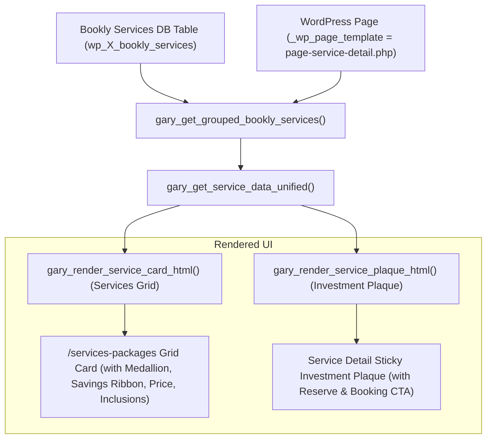

# 🔬 Reverse Engineering Specification: `wedding.garywallage.uk` (The Master Template Blueprint)

**Purpose**: Complete architectural and component blueprint reverse-engineered from `wedding.garywallage.uk` (Blog #2). This serves as the single implementation standard for all other sub-sites (`boudoir`, `glamour`, `family`, `fashion`, `cosplay`, `portrait`).

---

## 🏛️ 1. Core Architecture & Page Template System

`wedding.garywallage.uk` uses a dual-engine architecture:
1. **WordPress Page Template Layer**:
   - **`page-services.php`** (Template Name: `Services`): Assigned to `/services-packages`. Automatically queries Bookly service tables (`wp_X_bookly_services`) via `gary_get_grouped_bookly_services()` and dynamically renders two interleaved grid sections:
     - **`Packages`**: Compound services (with savings ribbons and inclusion checklists).
     - **`Individual Services`**: Atomic services (with duration tags and single pricing).
   - **`page-service-detail.php`** (Template Name: `Service Detail`): Assigned to all individual service and package pages (`_wp_page_template = page-service-detail.php`).
   - **`page-experience.php`** (Template Name: `The Experience`): 4-step client journey with interactive date availability checkers.
   - **`page-faq.php`** (Template Name: `FAQ`): Dynamic accordion FAQ block.
   - **`page-about.php`** (Template Name: `About`): Photographer artist statement.

---

## 🧩 2. Individual Service Detail Page Structure (`page-service-detail.php`)

Every individual service and package landing page follows this exact Gutenberg block layout:

```html
<!-- wp:columns -->
<div class="wp-block-columns">
  <!-- wp:column {"width":"66.66%"} -->
  <div class="wp-block-column" style="flex-basis:66.66%">
    <!-- wp:heading {"textAlign":"center"} -->
    <h2 class="wp-block-heading has-text-align-center">Chapter Headline / Service Title</h2>
    <!-- /wp:heading -->

    <!-- wp:quote {"textAlign":"center"} -->
    <blockquote class="wp-block-quote has-text-align-center">
      <!-- wp:paragraph -->
      <p><em>Artistic quote or sub-heading.</em></p>
      <!-- /wp:paragraph -->
    </blockquote>
    <!-- /wp:quote -->

    <!-- wp:paragraph -->
    <p>Narrative overview paragraphs explaining the experience, atmosphere, and artistic vision.</p>
    <!-- /wp:paragraph -->
  </div>
  <!-- /wp:column -->

  <!-- wp:column {"width":"33.33%"} -->
  <div class="wp-block-column" style="flex-basis:33.33%">
    <!-- wp:gw/investment-plaque {"target_email":"photographer@garywallage.uk"} /-->
  </div>
  <!-- /wp:column -->
</div>
<!-- /wp:columns -->

<!-- wp:gw/how-it-works /-->

<!-- wp:shortcode -->
[bookly-search-form service-slug]
<!-- /wp:shortcode -->

<!-- wp:gw/package-includes /-->

<!-- wp:heading -->
<h2 class="wp-block-heading"><strong>What's Included</strong></h2>
<!-- /wp:heading -->
<!-- wp:list -->
<ul class="wp-block-list">
  <!-- wp:list-item --><li>Bullet item 1</li><!-- /wp:list-item -->
  <!-- wp:list-item --><li>Bullet item 2</li><!-- /wp:list-item -->
</ul>
<!-- /wp:list -->

<!-- wp:heading -->
<h2 class="wp-block-heading"><strong>Perfect For</strong></h2>
<!-- /wp:heading -->
<!-- wp:list -->
<ul class="wp-block-list">
  <!-- wp:list-item --><li>Ideal client profile 1</li><!-- /wp:list-item -->
</ul>
<!-- /wp:list -->

<!-- wp:heading -->
<h2 class="wp-block-heading"><strong>Available Add-Ons</strong></h2>
<!-- /wp:heading -->
<!-- wp:list -->
<ul class="wp-block-list">
  <!-- wp:list-item --><li>Addon 1 — £XX</li><!-- /wp:list-item -->
</ul>
<!-- /wp:list -->

<!-- wp:paragraph -->
<p><strong>SEO Keywords: </strong><em>keyword1, keyword2, keyword3</em></p>
<!-- /wp:paragraph -->
```

---

## ⚙️ 3. Card Renderer & Data Flow (`inc/card-renderer.php`)



### Key Data Fields:
* **`title`**: Sanitized service name (e.g. `The Full Day`).
* **`price`**: Formatted GBP price (`£1,695.00` or `FREE`).
* **`savings`**: Calculated automatically when sub-services are combined in a compound package (`SAVE £350`).
* **`inclusions`**: Sub-service titles pulled from Bookly compound addons.
* **`duration`**: Formatted time tag (`Typically 8 Hours`).
* **`thumbnail`**: Featured WebP image (`_thumbnail_id`) or custom logo fallback.

---

## 📋 4. Directives for Claude (Aesthetic & Editorial Refinement)

1. **Child Theme Token Harmony**:
   * Use each child theme's `:root` CSS tokens (`--brand-primary`, `--brand-accent`, `--brand-bg`) to color the `.service-card-ribbon`, `.investment-plaque`, and `.btn-black-gold` buttons.
2. **Never-Crop & 10-80-10 Layout Rules**:
   * Maintain the 10% outer viewport margin on desktop and 80% maximum container width (`.container { max-width: 1200px; margin: 0 auto; padding: 0 10%; }`).
3. **Template Assignment**:
   * Ensure `/services-packages` has `_wp_page_template` = `page-services.php`.
   * Ensure all individual service pages have `_wp_page_template` = `page-service-detail.php`.
